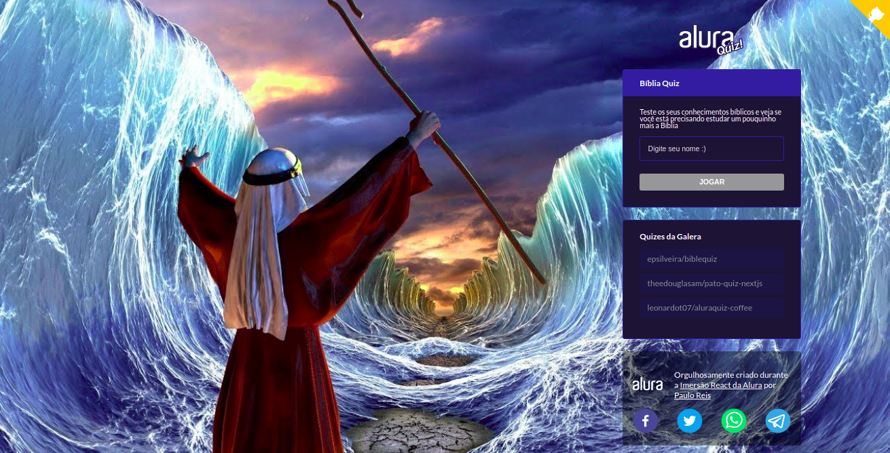

<div align="center">
<h1>Bibliaquiz</h1>
</div>

Projeto desenvolvido durante a [Imersão React Next.js](https://www.alura.com.br/imersao-react-next-js) da [Alura](https://www.alura.com.br). :computer:

<br>
<div align="center"></div>

[Clique aqui para acessar o quiz!!](https://bibliaquiz.prscreis.vercel.app) :book:
<br>
<br>

### Principais bibliotecas utilizadas:

- [Next.js](https://nextjs.org/)
- [React.js](https://pt-br.reactjs.org/)
- [Styled components](https://styled-components.com/)
- [Framer Motion](https://framer.com/motion/)
- [prop-types](https://npmjs.com/package/prop-types)

### Melhorias no projeto original:

- implementação de desafios propostos
- tela de resultados detalhada
- níveis de dificuldade (fácil, médio e difícil)
- embaralhamento de questões a partir do nível médio

### Como executar:

```bash
# baixa dependências do projeto
yarn
# executa em http://localhost:3000
yarn dev
```

### Acesse:

- [Bibliaquiz](https://bibliaquiz.prscreis.vercel.app/)
- [Meu website](https://www.pauloreis.dev/)
- [Bíblia online](https://www.bibliaonline.com.br/)
